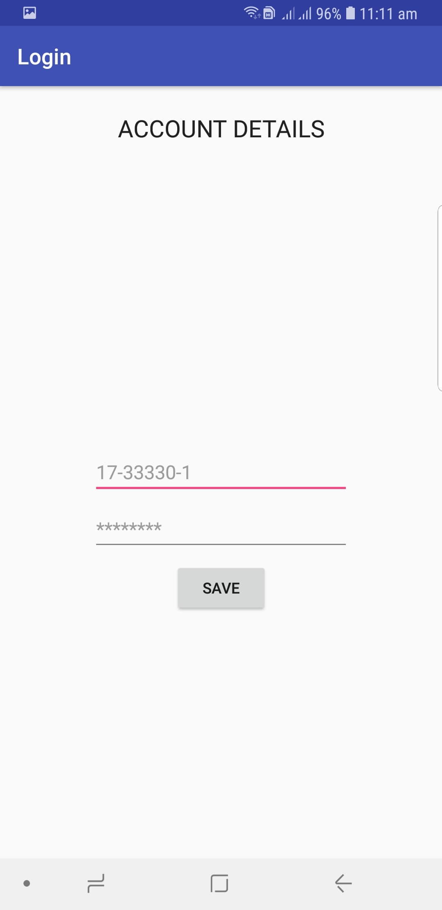
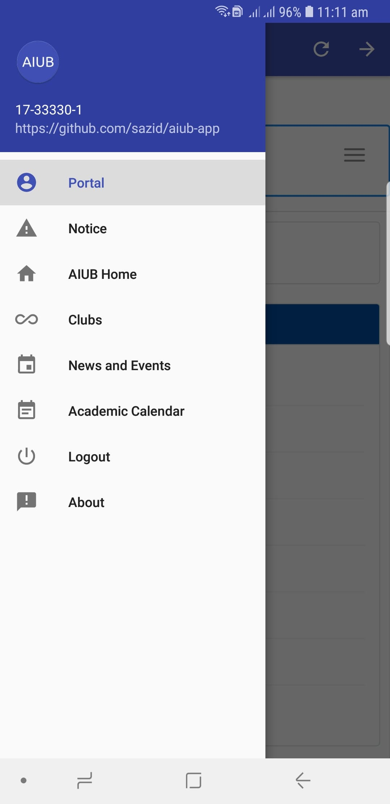
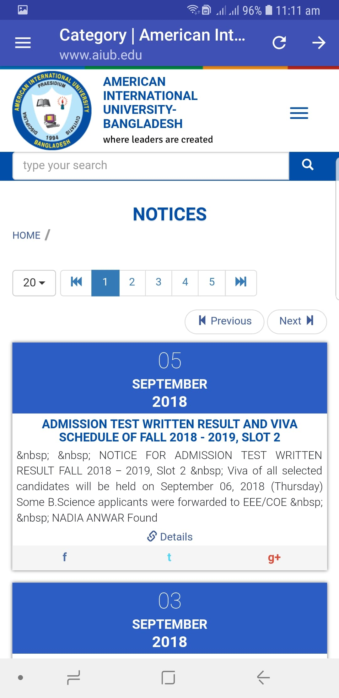
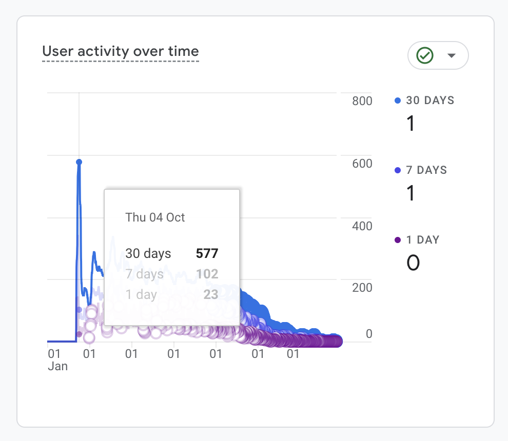
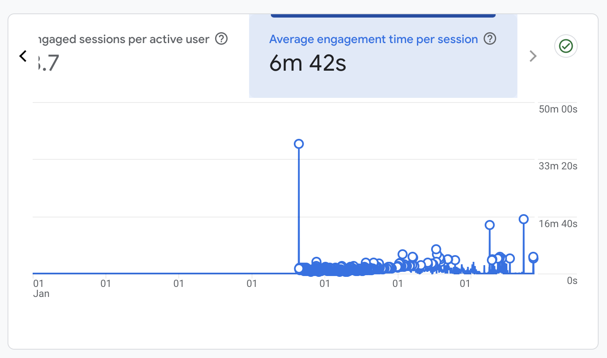
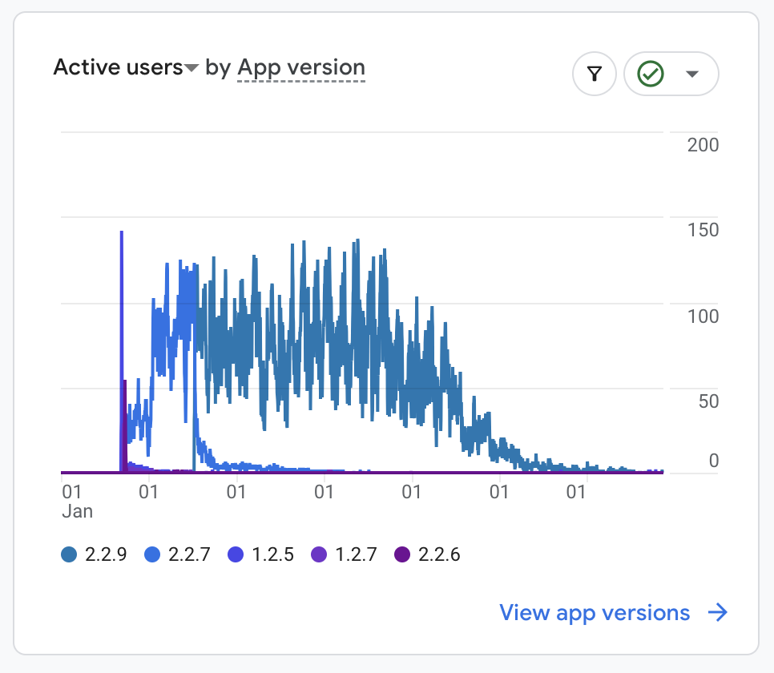
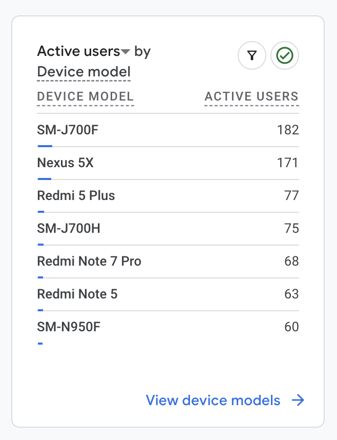

# AIUBian
A lightweight and fast android app for accessing the AIUB Portal and other AIUB related websites with additional features like: **auto login**, **portal notifications**, **notice board notification**, etc.

## Screenshots
</img>
</img>
</img>

## Interesting analytics

Below is a list of interesting analytics data that was automatically collected
by the Google Crashlytics platform. What was initially motivating to me was the
initial popularity of the app among the students.

### Activity over time

### Average engagement time

### Active users per version

### Popular devices

